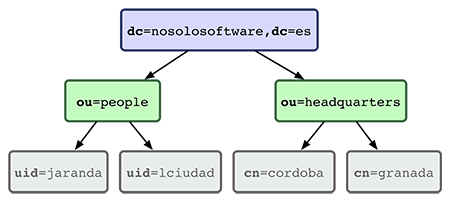

# Cómo instalar y configurar OpenLDAP

> **Aviso**: el objetivo de esta guía es disponer en un documento toda la información necesaria para
> instalar y configurar desde cero un servidor *OpenLDAP* en *Ubuntu 14.04 LTS*. Se entiende que el
> usuario ya conoce qué es y para qué sirve *OpenLDAP*.


## Conceptos

Un servidor de directorio como *OpenLDAP* nos permite introducir información jerarquizada de manera
muy similar a cómo se estructura una organización en la vida real.

Por ejemplo, supongamos que nuestra organización se llama NoSoloSoftware y queremos almacenar
información sobre nuestros empleados y de las distintas sedes físicas. La estructura de nuestro
directorio sería algo así:



### Terminología

* **dc** o *domain component*  sirve para especificar en qué organización se encuentra nuestro
  objeto, ya que dentro de un servidor podemos tener varias.
* **ou** u *organizational unit* nos permite indicar, dentro de la jerarquía de la organización,
  dónde se encuentra nuestro objeto.
* **uid** o *userid* es un atributo con el que podemos identificar de manera única a un usuario en
  nuestro sistema.
* **cn** o *common name* es un atributo que sirve para especificar el nombre de un objeto.
* **dn** o *distinguished name* es una serie de parejas clave/valor que identifica de manera única
  a cada registro de nuestro directorio.

Siguiendo con nuestro ejemplo anterior, el objeto `uid=jaranda` se encuentra dentro de la unidad
organizativa `people` que a su vez pertenece a la organización `nosolosoftware.es` y su
identificador único es:

```
uid=jaranda,ou=people,dc=nosolosoftware,dc=es
```

### Objetos

Los objetos son la unidad de información básica de un directorio y son el equivalente a una fila de
una tabla en un sistema relacional de datos. En una organización pueden ser personas, mobiliario,
equipos informáticos, coches de empresa, etc.

Están formados por un identificador único (DN) y por atributos que contienen información relevante
sobre el objeto de la vida real al que representan. Si tuvierámos que modelar un objeto que sirva
para guardar datos de los empleados de una compañia podríamos necesitar los siguientes atributos:

* Nombre y apellidos
* Cargo
* Nombre de usuario
* Contraseña
* Correo electrónico
* Teléfono

Cuya equivalencia en *LDAP* podía ser la siguiente:

```
# ejemplo de objeto
dn: uid=jaranda,ou=people,dc=nosolosoftware,dc=es
cn: Javier Aranda
uid=jaranda
userPassword={SSHA}Z543543jhjh3535Gds8DDSw832
mail=jaranda@nosolosoftware.es
phone=957000000
```


## Instalación

```bash
$ sudo apt-get update
$ sudo apt-get install slapd
```

Durante el proceso de instalación el asistente nos pide introducir una contraseña para el usuario
administrador y posteriormente repetirla para asegurarse de que la hemos escrito bien. Esta
contraseña debe ser fuerte (yo suelo usar el comando `apg` para generar contraseñas seguras).

Lo siguiente que debemos hacer es reconfigurar el servicio para que, mediante el asistente, podamos
configurar de manera sencilla el servidor *OpenLDAP* que acabamos de instalar.

```bash
$ sudo dpkg-reconfigure slapd
```

El asistente nos realizará una serie de preguntas que debemos responder.

* ¿Desea omitir la configuración? **No**
* Introduzca su nombre de dominio. En mi caso voy a usar **nosolosoftware.es**.
* Nombre de la organización: **nosolosoftware.es**.
* Contraseña del administrador. Aquí ponemos la contraseña que queramos. En realidad la que
  escribamos va a sobreescribir la que inicialmente durante la instalación le pusimos, por lo que
  lo normal es volver a poner la misma.
* Motor de la base de datos: **HDB**.
* ¿Desea que se borre la base de datos cuando se purge el paquete? **No**.
* ¿Mover la base de datos antigua? **Si**.
* ¿Desea permitir el protocolo LDAP v2? **No**.

En este punto ya tenemos nuestro servidor configurado de forma más o menos correcta.

### Shelldap

Se trata de una herramienta para configurar *OpenLDAP* de manera sencilla usando unos pocos
comandos y un editor de texto, lo que nos ahorra tener que estar creando archivos *\*.ldif* y
cargándolos en el servidor.

Para instalarlo recurrimos como siempre al gestor de paquetes de Ubuntu.

```bash
$ sudo apt-get install shelldap
```

Para no tener que estar introduciendo los datos de conexión al servidor *OpenLDAP* cada vez,
*shelldapp* nos permite almacenar la configuración en el archivo `.shelldap.rc` situado en la home
del usuario. El contenido de este archivo es muy simple:

```
server: 127.0.0.1
binddn: cn=admin,dc=nosolosoftware,dc=es
bindpass: "nuestra contraseña supersecreta"
basedn: dc=nosolosoftware,dc=es
```

Evidentemente hay que sustituir esos datos por aquellos que reflejen la configuración adecuada para
vuestra instalación. Si todo ha ido bien, al ejecutar el comando deberemos obtener algo así:

```bash
$ shelldap
~ >
```

Lo cual significa que estamos dentro de esta mini shell en la que tendremos disponibles los
comandos. Al igual que ocurre con shells como *Bash*, el autocompletado se hace usando la tecla
*Tab* (tabulador).


## Configuración

Ahora que ya hemos instalado el servidor de *LDAP* y conocemos un poco como se organiza un
directorio, es hora de empezar a configurarlo para adaptarlo a nuestra organización.

### Añadir unidades organizativas

Para realizar modificaciones en *LDAP* usaremos la herramienta *shelldap* que instalamos
anteriormente, ya que nos facilita mucho este trabajo. Una vez dentro, usamos el comando
`create <clase>` para añadir un nuevo objeto de tipo &lt;clase&gt; a nuestro directorio.

```
~ > create organizationalUnit
```

Tras lo cual se abrirá el editor de texto por defecto del sistema para que editemos los datos de
nuestro nuevo objeto.

```
dn: ???,dc=nosolosoftware,dc=es
objectClass: organizationalUnit
ou:
# businessCategory:
# description:
# destinationIndicator:
# facsimileTelephoneNumber:
# internationaliSDNNumber:
# l:
# physicalDeliveryOfficeName:
# postOfficeBox:
# postalAddress:
# postalCode:
# preferredDeliveryMethod:
# registeredAddress:
# searchGuide:
# seeAlso:
# st:
# street:
# telephoneNumber:
# teletexTerminalIdentifier:
# telexNumber:
# userPassword:
# x121Address:
```

Como podemos observar, aparecen una serie de campos para que los rellenemos y otros comentados,
siendo los primeros los campos obligatorios y los segundos los opcionales. Editamos el contenido
del archivo de manera que refleje la información que deseamos almacenar. En este ejemplo sólo vamos
a introducir la información obligatoria.

```
dn: ou=people,dc=nosolosoftware,dc=es
objectClass: organizationalUnit
ou: people
```

Cuando guardamos y cerramos el editor, *shelldap* intenta realizar la operación contra el servidor
de *OpenLDAP* y nos muestra el resultado en la consola. Si todo ha ido bien nos lo indicará con el
mensaje `Success`.

También podríamos haber usado el comando `mkdir` para realizar este mismo proceso.

```
~ > mkdir ou=people
```

### Añadir objetos a las unidades organizativas

Al igual que hemos hecho en el punto anterior, volvemos a usar el comando `create <clase>` para
añadir un nuevo objeto a nuestro *LDAP*.

```
~ > create inetOrgPerson
```

Tras lo cual nos abre el editor del sistema con un esquema del objeto para que nosotros lo
rellenemos con los datos que nos interese.

```
dn: ???,dc=nosolosoftware,dc=es
objectClass: inetOrgPerson
cn:
sn:
# audio:
# businessCategory:
# carLicense:
# departmentNumber:
# description:
# destinationIndicator:
# displayName:
# employeeNumber:
# employeeType:
# facsimileTelephoneNumber:
# givenName:
# homePhone:
# homePostalAddress:
# initials:
# internationaliSDNNumber:
# jpegPhoto:
# l:
# labeledURI:
# mail:
# manager:
# mobile:
# o:
# ou:
# pager:
# photo:
# physicalDeliveryOfficeName:
# postOfficeBox:
# postalAddress:
# postalCode:
# preferredDeliveryMethod:
# preferredLanguage:
# registeredAddress:
# roomNumber:
# secretary:
# seeAlso:
# st:
# street:
# telephoneNumber:
# teletexTerminalIdentifier:
# telexNumber:
# title:
# uid:
# userCertificate:
# userPKCS12:
# userPassword:
# userSMIMECertificate:
# x121Address:
# x500UniqueIdentifier:
```

En nuestro caso vamos a rellenar sólo los siguientes atributos:

```
dn: uid=jaranda,ou=people,dc=nosolosoftware,dc=es
objectClass: inetOrgPerson
cn: Javier
ou: people
sn: Aranda
uid: jaranda
userPassword: 12345
```

Si nos fijamos, mediante el campo `dn` hemos indicado que queremos que ese objeto sea accesible
mediante su `uid` que es *jaranda* y con el atributo `ou` indicamos que se encuentre anidado bajo
la unidad organizativa *people*. En el atributo `userPassword` hemos introducido un valor temporal
para cambiar posteriormente la contraseña. No introducir una contraseña real puesto que se
guardaría en texto plano y cualquiera con acceso de lectura de esa entrada podría conocerla.

### Modificar la contraseña de un objeto

Hay objetos como el que acabamos de crear para el usuario *jaranda* que tienen un atributo para
especificarle una contraseña: `userPassword`. Mediante el uso de *shelldap* podemos simplificar
este proceso usando el comando `passwd <objeto>`.

```
~ > passwd uid=jaranda
Changing password for uid=jaranda,ou=people,dc=nosolosoftware,dc=es
Enter new password: *******
Retype new password: *******
Password updated successfully.
```

Si ahora mostramos el contenido de nuestro objeto, podemos observar que ya tiene almacenada la
contraseña y que ésta además se encuentra cifrada.

```
~ > cat uid=jaranda

dn: uid=jaranda,ou=people,dc=nosolosoftware,dc=es
objectClass: inetOrgPerson
cn: Javier
ou: people
sn: Aranda
uid: jaranda
userPassword: {SSHA}xpPLLh1itOSswErscoN5PESF/kUYq0DU
```

### Editar un objeto

Realizar cambios en un objeto de *LDAP* es un proceso sencillo usando *shelldap*. Para ello,
tenemos disponible el comando `edit <path>` al cual deberemos pasarle la "ruta" dentro del
directorio dónde se encuentra el objeto.

Siguiendo con los ejemplos anteriores, si quisiéramos editar el usuario *jaranda* creado
anteriormente, lo haríamos escribiendo en la consola:

```
~ > edit uid=jaranda,ou=people
```

*Shelldap* se encarga de abrir el editor por defecto del sistema y de mostrar el contenido de ese
objeto para que podamos editarlo. Cuando guardamos y cerramos, se encarga también de detectar si ha
sido modificado y en caso afirmativo, de subir los cambios al servidor. El resultado de la operación
se muestra en la terminal, para que sepamos si ha sido modificado correctamente o ha fallado algo.

### Eliminar un objeto

De la misma forma que la edición, tenemos disponible otro comando para eliminar un objeto del
directorio. Ese comando, como ya seguramente puedes intuir, se trata de `delete <path>`y su uso es
idéntico al `edit`: como parámetro le pasaremos la ruta del objeto que queremos eliminar.

Al hacer esto, si el objeto ha sido encontrado, la consola nos pedirá confirmar la operación para
evitar que borremos algo que no debamos.

```
~ > delete uid=jaranda,ou=people
Are you sure? [Ny]: y
uid=jaranda,ou=people,dc=nosolosoftware,dc=es: Success
```

### Otros comandos útiles

A parte de los comandos que ya hemos visto, *Sheldapp* incorpora muchos comandos que pueden sernos
útiles en un momento dado. Repasamos a continuación aquellos que son más relevantes.

* **cat &lt;path&gt;**: muestra el contenido de un objeto. Ejemplo: `cat uid=jaranda`.
* **cd &lt;path&gt;**: cambia el directorio actual al especificado en *path*.
* **copy &lt;current\_path&gt; &lt;new_path&gt;**: copia un objeto. Ejemplo:
  `copy uid=jaranda uid=lciudad`. Resulta muy útil para crear nuevas entradas en el directorio a
  partir de un objeto ya existente.
* **inspect &lt;object&gt;**: muestra información sobre el esquema usado en un objeto o clase. Esto
  resulta útil para saber que campos son obligatorios y cuales opcionales en una clase que queremos
  usar. Por ejemplo: `inspect inetOrgPerson` nos muestra los campos que esa clase añade a los
  objetos que la implementan.
* **ls** o **list**: muestra un listado de los objetos que existen el el directorio actual.
* **mv** o **move**: mueve un objeto a otro *dn* diferente. Su uso el idéntico a *copy*.

No es necesario memorizar todos estos comandos. Recuerda que estando en la consola, si pulsamos la
tecla de tabulación se muestra un listado de todos los comandos disponibles. Y también tenemos
disponible el comando `help` que nos muestra ese mismo listado pero con una descripción de lo que
hace cada comando y de cómo podemos usarlo.
